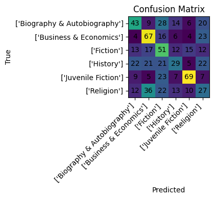
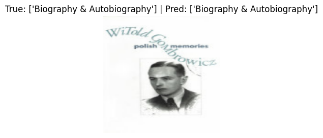

# Book Cover Classifier  
**EfficientNetB0 + Hyperparameter Tuning**

## Overview
This project implements an **image classification pipeline** that predicts a book’s category from its cover image. It was developed for the MSc course **[Algorithms for Massive Data Sets](https://www.unimi.it/en/education/degree-programme-courses/2025/algorithms-massive-datasets)** at the University of Milan.

The workflow is **Colab-first** and covers:
- Automated data acquisition from Kaggle  
- Parallel image downloading from URLs  
- Transfer learning with **EfficientNetB0**  
- Hyperparameter tuning via **KerasTuner**  
- Evaluation, interpretability, and rich visualizations  
- Export of deployable model artifacts  

---

## ✨ Key Features
- **Automated data acquisition**: Downloads the [Amazon Books Reviews dataset](https://www.kaggle.com/datasets/mohamedbakhet/amazon-books-reviews) and fetches cover images from URLs.
- **Transfer learning**: EfficientNetB0 backbone with optional fine-tuning.
- **Hyperparameter search**: RandomSearch over head size, dropout rate, learning rate, and fine-tuning depth.
- **Robust training**: Class weighting, augmentation, early stopping, LR scheduling, and checkpointing.
- **Evaluation metrics**: Accuracy, macro-F1, classification report, confusion matrix.
- **Interpretability**: Misclassification gallery, t-SNE/UMAP embeddings, Grad-CAM overlays.
- **Exportable model**: TensorFlow SavedModel, `.keras` format, and JSON label mapping.

---

## 📂 Dataset
**Source**: [Amazon Books Reviews — Kaggle](https://www.kaggle.com/datasets/mohamedbakhet/amazon-books-reviews)  
**Columns used**:
- `image` → URL of the book cover  
- `category` → target label  

**Preprocessing**:
- Drop rows with missing URL or label
- Optional: filter classes by frequency or restrict to top-K categories

---

## 📁 Project Structure
```
Book_Cover_Classifier_Colab.ipynb   # Main notebook: data → training → evaluation → export
```

---

## ⚙ Requirements
**Recommended**: Google Colab with GPU runtime enabled  
**Local (optional)**:
- Python 3.9+
- Dependencies:
  ```
  tensorflow
  keras-tuner
  scikit-learn
  pandas
  matplotlib
  pillow
  tqdm
  opendatasets
  umap-learn
  kaggle
  ```

### Local Setup
```bash
python3 -m venv .venv
source .venv/bin/activate  # Windows: .venv\Scripts\activate
pip install -U tensorflow keras-tuner scikit-learn pandas matplotlib pillow tqdm opendatasets umap-learn kaggle

# Optional: Run notebook locally
pip install -U jupyterlab
jupyter lab
```

---

## 🔑 Kaggle Credentials
If automatic download via `opendatasets` fails, the notebook uses Kaggle CLI.  
1. Generate a token: **Kaggle → Account → Create New Token**  
2. In Colab: provide `username` and `key` when prompted  
3. Locally: place `kaggle.json` in `~/.kaggle/kaggle.json` with permissions `600`

---

## 🚀 Quickstart (Colab)
1. Open `Book_Cover_Classifier_Colab.ipynb` in Google Colab  
2. Set **Runtime → Change runtime type → GPU**  
3. Run all cells top-to-bottom  
4. Provide Kaggle credentials if prompted  
5. The notebook will download data, train, evaluate, visualize, and export artifacts  

---

## 🔧 Configuration
Configurable parameters (in notebook config cell):
- **Data**: `CSV_PATH`, `URL_COL`, `LABEL_COL`, `DATA_DIR`
- **Sampling**: `MIN_SAMPLES_PER_CLASS`, `TOP_K_CLASSES`
- **Splits**: `VAL_FRAC`, `TEST_FRAC`, `SEED`
- **Images**: `IMG_SIZE`, `BATCH_SIZE`
- **Downloads**: `MAX_DOWNLOAD_WORKERS`, `RETRY_ATTEMPTS`, `TIMEOUT_SEC`

---

## 📜 Training Pipeline
1. Load and clean CSV; visualize label distribution  
2. Download/cache images in parallel; drop failures  
3. Encode labels; stratified train/val/test split  
4. Build `tf.data` pipelines with EfficientNet preprocessing and augmentation  
5. Compute class weights for imbalance  
6. Run RandomSearch over model head & training hyperparameters  
7. Train final model with best settings & callbacks  
8. Evaluate on test set; generate metrics and plots  
9. Visualize embeddings, misclassifications, Grad-CAM  
10. Export model and label mapping  

---

## 📦 Outputs
Default export directory (Colab): `/content/book_covers/`
- `export/model_savedmodel/` — TensorFlow SavedModel  
- `export/model.keras` — Keras format model  
- `export/label_mapping.json` — `class_to_idx` and `idx_to_class` mappings  

---

## 🖥 Inference Example
```python
import json, numpy as np, tensorflow as tf
from PIL import Image

export_dir = "book_covers/export"
model = tf.keras.models.load_model(f"{export_dir}/model.keras")

with open(f"{export_dir}/label_mapping.json") as f:
    idx_to_class = {int(k): v for k, v in json.load(f)["idx_to_class"].items()}

IMG_SIZE = (224, 224)
def preprocess(path):
    img = Image.open(path).convert("RGB").resize(IMG_SIZE)
    x = np.array(img, dtype=np.float32)[None, ...]
    return tf.keras.applications.efficientnet.preprocess_input(x)

x = preprocess("/path/to/cover.jpg")
pred = int(np.argmax(model.predict(x), axis=1)[0])
print(idx_to_class[pred])
```

---

## 📊 Results
- **Test Accuracy**: 0.3972 (6 classes, 720 images)  
- **Macro Metrics**: Precision 0.40, Recall 0.40, F1 0.39  
- **Best LR**: 0.001 (val_acc ≈ 0.414 during search)

**Classification Report**:
```
precision    recall  f1-score   support

Biography & Autobiography   0.42   0.36   0.39   120
Business & Economics        0.43   0.56   0.49   120
Fiction                     0.32   0.42   0.36   120
History                     0.36   0.24   0.29   120
Juvenile Fiction            0.63   0.57   0.60   120
Religion                    0.24   0.23   0.23   120

accuracy                    0.40   720
macro avg                   0.40   0.40   0.39   720
weighted avg                0.40   0.40   0.39   720
```

**Visualizations**:
- Confusion matrix  
    
- Training curves & embeddings  
    
- Example prediction  
    

---

## 🛠 Troubleshooting
- **Kaggle download fails**: Check `kaggle.json` location & permissions  
- **High image download failures**: Lower `MAX_DOWNLOAD_WORKERS`, increase `TIMEOUT_SEC`  
- **GPU/CUDA issues locally**: Prefer Colab GPU or match TensorFlow–CUDA versions  
- **OOM during training**: Reduce `BATCH_SIZE` or `IMG_SIZE`, disable fine-tuning  

---

## 🙏 Acknowledgements
- Dataset by Mohamed Bakhet (Kaggle)  
- EfficientNet (Tan & Le) via `tf.keras.applications`  
- Hyperparameter tuning with KerasTuner  

---

## 📄 License
Currently no explicit license. Consider adding one (MIT, Apache-2.0, etc.) for clarity on usage and distribution.
